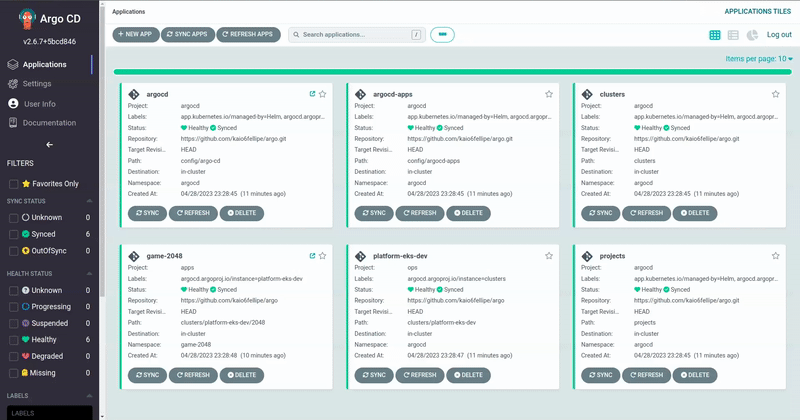

# A project to practice Argo CD and GitOps

> Bootstrap management and application management of my Kubernetes applications.

## 🧐 How it works?

This project was based on the following topic that is present in the official ArgoCD documentation: [Manage Argo CD using Argo CD](https://argo-cd.readthedocs.io/en/stable/operator-manual/declarative-setup/#manage-argo-cd-using-argo).

Special thanks to [@kurtburak](https://github.com/kurtburak) for his article on Medium: ["Self Managed Argo CD — App Of Everything"](https://medium.com/devopsturkiye/self-managed-argo-cd-app-of-everything-a226eb100cf0), it gave me a great foundation to get started with these setups.

So, basically my Argo installation will be self managing its own settings present in the `config` folder. For this, first I install it with [Terraform](https://github.com/kaio6fellipe/terraform-devops/blob/development/stack/platform/platform-k8s/helm.tf#L1_L44) in my main cluster on AWS and then I guarantee that the resource created in Terraform will not apply any more changes.

## ✨ Demo



## 🛠️ Setup

Bootstrap ArgoCD with Terraform and Helm:

```terraform
terraform {
  required_version = ">= 1.0"

  required_providers {
    helm = {
      source  = "hashicorp/helm"
      version = ">= 2.7"
    }
    github = {
      source  = "integrations/github"
      version = "~> 5.0"
    }
  }
}

provider "helm" {
  kubernetes {
    host                   = try(data.kubernetes_host, "")
    cluster_ca_certificate = try(base64decode(data.cluster_ca_certificate), "")
    token                  = try(data.token, "")
  }
}

data "github_repository_file" "argocd" {
  repository = "kaio6fellipe/argo"
  branch     = "main"
  file       = "config/argo-cd-values.yaml"
}

data "github_repository_file" "argocd_apps" {
  repository = "kaio6fellipe/argo"
  branch     = "main"
  file       = "config/argocd-apps-values.yaml"
}

resource "helm_release" "argocd" {
  chart            = "argo-cd"
  name             = "argocd"
  namespace        = "argocd"
  create_namespace = true
  repository       = "https://argoproj.github.io/argo-helm"
  version          = "5.28.1"
  force_update     = true

  values = [
    data.github_repository_file.argocd.content
  ]

  lifecycle {
    ignore_changes = all
  }
}

resource "helm_release" "argocd_apps" {
  chart            = "argocd-apps"
  name             = "argocd-apps"
  namespace        = "argocd"
  create_namespace = true
  repository       = "https://argoproj.github.io/argo-helm"
  version          = "0.0.9"
  force_update     = true

  values = [
    data.github_repository_file.argocd_apps.content
  ]

  depends_on = [
    helm_release.argocd,
  ]

  lifecycle {
    ignore_changes = all
  }
}
```

**Obs**: Ensure you have a properly configured cluster before doing this and override settings as needed.

## ⭐️ Show your support

Please ⭐️ this repository if this project helped you!